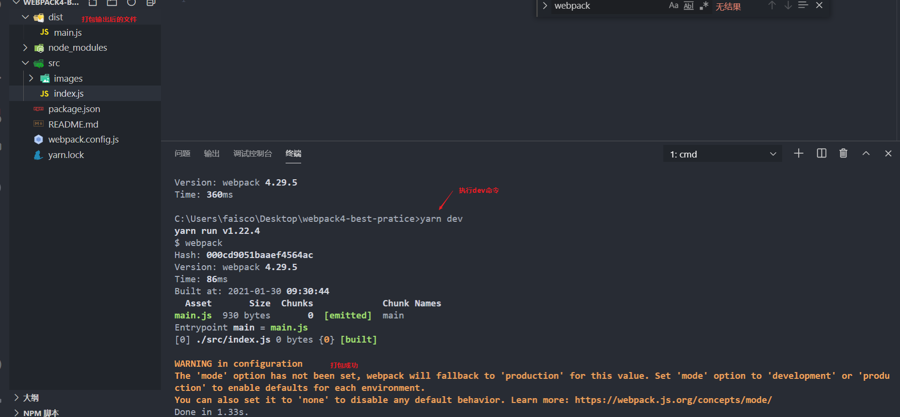
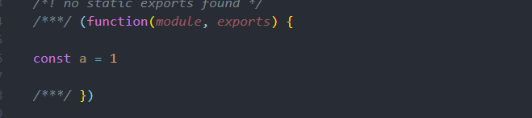
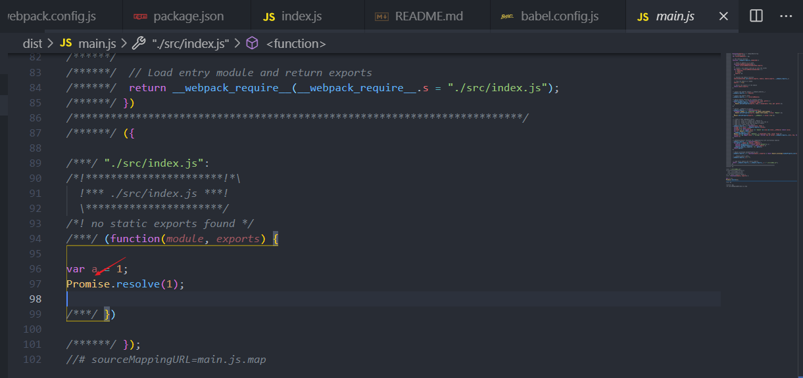
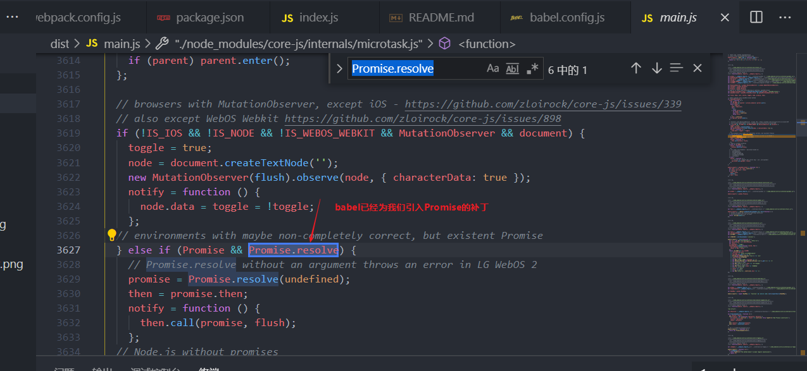

# webpack4最佳实践

## 安装webpack

``` shell
# 安装4最新版本
yarn add webpack@"^4.0.0"
```

## 加上配置文件 webpack.config.js

``` js
module.exports = {
    entry: './src/index.js'
    // 开发模式
    mode:'development',
    // 单独提取source-map，输出后的js更可读
    devtool : 'source-map'
};
```

## 添加运行命令

**package.json**

``` json
{
  "name": "webpack4-best-pratice",
  "version": "1.0.0",
  "main": "index.js",
  "license": "MIT",
  "scripts": {
     // 添加dev命令
    "dev": "webpack"
  },
  "dependencies": {
    "webpack": "^4.0.0"
  }
}
```

## 添加src目录并运行

``` shell
yarn dev
```




##  javascript代码环境降级

**babel通过编译es6到es5实现了开发中使用es6代码部署中又不用考虑浏览器兼容**


### 安装babel

``` shell
# @babel/core babel转换器核心代码
# @babel/preset-env 配置babel环境转换
# babel-loader baberl的webpack插件
yarn add babel-loader @babel/core @babel/preset-env
```

### 使用webpack编译代码

在src/index.js新增

``` js
const a = 1
```

执行dev命令

``` shell
yarn dev
```





查看输出结果发现我们的const没有被编译成es5，接下来我们来解决这个问题


### 配置babel转译语法

新增`babel.config.js`

``` js
module.exports = {
    // 引入编译选项
    presets: [
        [
            '@babel/preset-env'
        ],
    ],
};
```

### 配置webpack对js文件使用babel编译

``` js
module.exports = {
    // .... 新增module字段
    module: {
        rules: [
          { 
            // 匹配.js文件
            test: /\.js$/,
            // 排除node_modules提升编译效率
            exclude: /(node_modules)/,
            // 使用babel-loader
            use: {
              loader: 'babel-loader',
            }
          }
        ]
    }
    // ...
};
```

### 执行命令验证编译结果

``` shell
yarn dev
```


可以看到我们的const已经被转译成了var

### 缺失的ES6+ API编译

我们在index.js新增

``` js
Promise.resolve(1)
```

执行

``` shell
yarn dev
```



可以看到我们的Promise并没有转译，也就会缺少API级别的兼容性

### 配置ES6+ API编译

查看官网发现，babel将编译分成了2类，一类成为语法编译，一类称为polyfill

语法：

``` js
const a = 1
// 编译
var a  =  1
```

polyfill

``` js
Promise.resolve(1)
// 通过引入Promise
Promise = require('Promise')
```

也就是我们需要找到一个实现了`Promise`同时符合`ECMAScript`的API实现包，目前推荐的是`core-js`,在babel的配置下是这样的

**babel.config.js**

``` js
module.exports = {
    presets: [
        [
            '@babel/preset-env',{
                // 配置useBuiltIns为entry，防止依赖的第三方库没声明其es6+的API导致我们应用程序出错
                useBuiltIns: 'entry',
                // 使用corejs3版本，corejs2很早就冻结分支了，例如Array.prototype.flat只在corejs3版本
                corejs: 3
            }
        ],
    ],
};
```

**src/index.js**

``` js
// 引入core-js/stable和regenerator-runtime/runtime，相当于已经废弃的babel-polyfill
import 'core-js/stable'
import 'regenerator-runtime/runtime'

const a = 1
Promise.resolve(1)
```

打包结果



## css引入支持

在`src/css`下新增`globel.css`,内容如下：

``` css
body {
    background-color: rebeccapurple;
}
```

引入到`src/index.js`中

``` js
import './css/global.css'
```

执行`yarn dev`


出现报错提示我们可能需要这个文件类型的`loader`，这里需要安装`css-loader`,同时配置`webpack`

``` shell
yarn add css-loader
```

``` js
// 新增css文件处理
module.exports = {
    module: {
        rules: [
            {
                test: /\.css$/i,
                use: ["css-loader"],
            },
        ]
    }
};
```

安装完毕后执行`yarn dev`，发现已经不报错了

## 在src下新增index.html验证输出结果

``` html
<!DOCTYPE html>
<html lang="en">
<head>
    <meta charset="UTF-8">
    <meta name="viewport" content="width=device-width, initial-scale=1.0">
    <title>Document</title>
</head>
<body>
    
</body>
<script src="../dist/main.js"></script>
</html>
```

我们在浏览器打开`index.html`发现样式并没有生效，这个时候我们需要引入`style-loader`,用来实现转换css到浏览器

``` shell
yarn add style-loader
```

**webpack.config.js**

``` js
module.exports = {
    module: {
        rules: [
            {
                test: /\.css$/i,
                // 新增style-loader
                use: ["style-loader","css-loader"],
            },
        ]
    }
};
```

执行`yarn dev`并刷新页面，看到css生效


## 配置CSS私有前缀编译

在一些特性没有完全实现的时候，浏览器厂商常常会使用前缀允许我们使用，这块可以通过`postcss`帮助我们在编译时完成

### 安装依赖

``` shell
# postcss 用来编译css
# postcss-loader postcss的webpack插件
# postcss-preset-env类似@babel/preset-env,配置编译环境
yarn add  postcss-loader postcss postcss-preset-env
```

### 配置webpack

``` js
module.exports = {
    module: {
        rules: [
            {
                test: /\.css$/i,
                // 新增postcss-loader
                use: ["style-loader","css-loader", "postcss-loader"],
            },
        ]
    }
};
```
### 新增postcss配置文件

postcss.config.js

``` js
module.exports = {
    plugins: [
      [
        "postcss-preset-env",
        {
          // 其他选项
        },
      ],
    ],
};
```

### 新增项目兼容浏览器范围配置

.browserslistrc

``` yaml
last 2 versions
```

### 修改global.css

``` css
body {
    background-color: rebeccapurple;
    /* 新增flex属性 */
    display: flex;
}
```

### 执行编译验证结果


编译后已经输出了flex的浏览器私有前缀

## 配置css预编译语言

这里我们配置sass

### 安装依赖

``` shell
#  sass，sass的编译器，比node-sass兼容性好
# sass-loader sass的webpack插件
yarn add sass  sass-loader
```

### 配置webpack

``` js
module.exports = {
    module: {
        rules: [
            {
                test: /\.s[ac]ss$/i,
                use: [
                  "style-loader",
                  "css-loader",
                  "sass-loader",
                ],
              },
        ]
    }
};
```


### 修改文件后缀验证

将src/css/global.css后缀改为scss，同时在index.js引入的后缀也改成css,运行`yarn dev`,打包成功

## 热更新

### 自动注入和copy index.html到dist

#### 安装依赖

``` shell
yarn add html-webpack-plugin
```

#### 配置webpack

``` js
const HtmlWebpackPlugin = require('html-webpack-plugin');
module.exports = {
    // 使用HtmlWebpackPlugin
    plugins: [new HtmlWebpackPlugin()]
};
```

### 配置热更新

#### 安装依赖

``` shell
# webpack-dev-server 热更新服务器
# webpack-cli webpack命令包
yarn add webpack-cli webpack-dev-server
```

#### 开启热更新

``` js
const HtmlWebpackPlugin = require('html-webpack-plugin');
module.exports = {
    // 开启热更新服务器配置
    devServer: {
        contentBase: './dist',
        hot: true,
    },
};
```

### 修改运行命令验证

package.json

``` json
"scripts": {
"dev": "webpack serve"
},
```

运行`yarn dev`


打开提示地址，查看结果，可以看到我们的代码已经在热更新服务器上运行，此时我们随意修改样式，可以实时生效

## 分离生产和开发环境配置

### 分离配置

**webpack.config.js**

``` js
const HtmlWebpackPlugin = require('html-webpack-plugin');
module.exports = {
    entry: './src/index.js',
    module: {
        rules: [
            {
                test: /\.js$/,
                exclude: /(node_modules)/,
                use: {
                    loader: 'babel-loader',
                },
            },
        ]
    },
    plugins: [new HtmlWebpackPlugin()]
};
```

**webpack.dev.config.js**

``` js
const baseWebpackConfig = require('./webpack.config')
const { merge } = require('webpack-merge');
module.exports =   merge(baseWebpackConfig, {
    mode:'development',
    devtool : 'eval-source-map',
    devServer: {
        contentBase: './dist',
        hot: true,
    },
    module: {
        rules: [
            {
                test: /\.css$/i,
                use: ["style-loader","css-loader", "postcss-loader"],
            },
            {
                test: /\.s[ac]ss$/i,
                use: [
                  "style-loader",
                  "css-loader",
                  "sass-loader",
                ],
            },
        ]
    },
});
```


**webpack.prod.config.js**

``` js
const baseWebpackConfig = require('./webpack.config')
const { merge } = require('webpack-merge');
module.exports =   merge(baseWebpackConfig, {
    mode:'production',
    devtool : 'source-map',
    module: {
        rules: [
            {
                test: /\.css$/i,
                use: ["style-loader","css-loader", "postcss-loader"],
            },
            {
                test: /\.s[ac]ss$/i,
                use: [
                  "style-loader",
                  "css-loader",
                  "sass-loader",
                ],
            },
        ]
    },
});
```

### 添加开发命令和生产命令

package.json

``` json
"scripts": {
    "dev": "webpack serve --config=./webpack.dev.config.js",
    "build": "webpack --config=./webpack.prod.config.js"
},
```

### 运行命令尝试

```yarn dev```


## 配置压缩

### javascript压缩

#### 安装依赖

``` shell
# 安装4.0最新版本，5版本只支持webpack5
terser-webpack-plugin@"^4.0.0"
```

#### 配置webpack

webpack.prod.config.js

``` js
const TerserPlugin = require("terser-webpack-plugin");
module.exports =   merge(baseWebpackConfig, {
    optimization: {
        minimize: true,
        minimizer: [new TerserPlugin()],
    },
});
```
#### 执行命令验证

`yarn build`


### 分离css到单独文件

#### 安装依赖

``` shell
yarn add mini-css-extract-plugin
```

#### 配置webpack

webpack.prod.config.js

``` js
const MiniCssExtractPlugin = require('mini-css-extract-plugin');
module.exports =   merge(baseWebpackConfig, {
    module: {
        rules: [
            {
                test: /\.css$/i,
                // 加上loader
                use: [MiniCssExtractPlugin.loader,"css-loader", "postcss-loader"],
            },
            {
                test: /\.s[ac]ss$/i,
                // 加上loader
                use: [
                  MiniCssExtractPlugin.loader,
                  "css-loader",
                  "sass-loader",
                ],
            },
        ]
    },
    // 加上插件
    plugins: [new MiniCssExtractPlugin()],
});
```

#### 执行命令验证

执行`yarn build`,可以看到我们的`dist`文件下新增了一个`main.css`

### 压缩css

#### 安装依赖

``` shell
yarn add css-minimizer-webpack-plugin
```

#### 配置webpack

webpack.prod.config.js

``` js
const CssMinimizerPlugin = require('css-minimizer-webpack-plugin');
module.exports =   merge(baseWebpackConfig, {
    // 新增CssMinimizerPlugin压缩插件
    minimizer: [new TerserPlugin(),new CssMinimizerPlugin()],
});
```

#### 运行命令验证

```yarn dev```，看到main.css已经被压缩

## 持久化缓存

这里建议阅读[这篇文章](https://segmentfault.com/a/1190000016355127),详细讲述了每个情况下文件缓存名变化的应对方案，最终总结下来的配置如下：

webpack.config.js

``` js
module.exports = {
    output: { 
        // 稳定文件hash
        filename: '[name].[contenthash].js',
        // 稳定chunk hash
        chunkFilename: '[name].[contenthash].js'
    }, 
};
```

webpack.prod.config.js

``` js
module.exports =   merge(baseWebpackConfig, {

    plugins: 
    [   
        // 稳定css hash
        new MiniCssExtractPlugin(
            {
                filename: '[name].[contenthash].css',
                chunkFilename: '[name].[contenthash].css'
            }
        ),   
        // 稳定chunk ID
        new webpack.NamedChunksPlugin(
            chunk => chunk.name || Array.from(chunk.modulesIterable, m => m.id).join("_")
        ),
    ],
    // 稳定模块 ID
    optimization: {
        hashedModuleIds: true,
    },
 
});
```

## js

- [x] 基本配置
  - [x] babel
  - [x] babel.config.js暴露
  - [x] polyfill 引入babel-polyfill即可

- [x] 代码优化
  - [x] Scope Hoisting
  - [x] tree Shaking

- [x] 调试
  - [x] source-map

- [x] 构建性能
  - [x] cache-loader
  - [x] thread-loader
  - [x] DllPlugin externals  跟项目不兼容

- [x] 压缩
  - [x] 压缩

- [x] 规范
  - [x] eslint 具体配置
  - [x] prettier 按需

## css

- [x] 基本配置
  - [x] sass
  - [x] postcss
  - [x] .browserslistrc暴露

- [x] 代码优化
  - [x] treeShaking 无法静态分析，风险大，不做

- [x] 构建性能
  - [x] fibers

- [x] 压缩
  - [x] 压缩

- [ ] 代码规范
  - [ ] styleLint  暂时没必要

## svg

- [x] svg
  - [x] 移除title
  - [x] 合并symbol

## vue

- [x] vue


## webpack

- [ ] 构建性能 接入项目后再具体优化

- [ ] 打包体积 接入项目后再具体优化

  - [ ] 按需加载
  - [ ] 拆分代码
